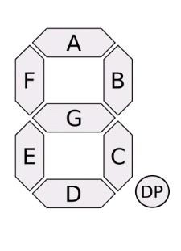

# Intel-Edison-interfacing-8-segment-display
Intel Edison Mini Breakout Board interfacing with a 8 segment display.


## How it works

You first need to require the `8_segment_display.js` file and then provide the pins to the `initialize`.

```
const EightSegment = require('./8_segment_display'),
const display = EightSegment.initialize(pinA, pinB, pinC, pinD, pinE, pinF, pinG, pinDP)
``` 

*Check the image below to see the corresponding letter*



#$ Reference

The method `initialize` returns an object with the next methods:

| Method        | Arguments     | Description              |
| ------------- | ------------- | ----------------------   |
| display0      | `none`        |  Displays the number `0` |
| display1      | `none`        |  Displays the number `1` |
| display2      | `none`        |  Displays the number `2` |
| display3      | `none`        |  Displays the number `3` |
| display4      | `none`        |  Displays the number `4` |
| display5      | `none`        |  Displays the number `5` |
| display6      | `none`        |  Displays the number `6` |
| display7      | `none`        |  Displays the number `7` |
| display8      | `none`        |  Displays the number `8` |
| display9      | `none`        |  Displays the number `9` |
| display9      | `none`        |  Displays the number `9` |
| setPointLed   | `boolean`     |  Turn on or off the point LED |
| displayNumber | `Number` 0 >= N >= 9 | Displays the given number |

## Still WIP